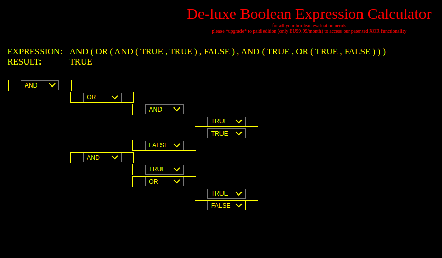

## React Based Boolean Expression Construction and Evaluation



## RUNNING THE APP
* use branch MAIN (lower case)!
* npm start - to start the development server - listen on localhost:3000 (should auto-start browser).
* npm test - to run the domain level unit tests (Exp.test.ts). Uses 'jest' (sort of...)

## SOURCE CODE STRUCTURE (SEE src DIR)

```
[ key: X ---> Y: X depends on (imports from) Y. ]

App.tsx (interface) [----> Exp too]
   |  
   |
ExpView.tsx (interface)             Exp.test.ts (test)
   |                                        |
   |->ConstExpView.tsx (interface)          |
   |  |                                     |
   |  |                                     | 
   V  V                                     | 
 Exp.ts (domain)<----------------------------
   |
   |-----------|
   V           V
AppEror.ts  utils.ts (infrastructure) (nb: most modules use these, as is normal)
```

* no cycles, etc in dependencies.
* seperation of business logic and UI code and infrastructure
* see also: https://www.infoq.com/articles/arm-enterprise-applications - for the architectural basis of modules subdivision;
  this app is is quite small, so doesn't need all the 'strata' - in particular there's no need for an 'application strata' here).

## SOURCE STYLE

* OO Style adopted (Expression evaluation is very suited to this)
* React classes used (well, it is Typescript - an OO/class based language, and it is not difficult to use classes with React)
* Important stuff: OAOO (once and only once), DRY (don't repeat yourself), single source of change for constant values, exporting of const values... SRP, CCP, ...

other:
* I have used a certain style here - normally I just go with whatever is the project standard, if there is one. It's not that important (to me).
* nb: wars have been fought over the position of a curly brace... beware! :-).
* import/export used (rather than 'require ...'')
* Class (capital first letter for name)
* variableOfSomeSort (lower case, camel-case style [sometimes])
* CONSTANT_IMMUTABLE_VALUE (intention is these values can't [and shouldn't] be changed).

nb: have not had time to lint this stuff properly, as I normally would.

## TEST CODE (xxxx.test.ts - TEST CODE FOR MODULE xxxx.ts)

* all tests pass - uses: jest (pretty basic use)
* coverage is reasonably good.
* 'npm test' to run tests.
* uses <assert(a === 2*b)> rather than: <jest.expect(a).to.be.double.the.value.of.another.value(b).if.it.is.a.wednesday()>; 


## TOOLS (versions used)
* tsc - 4.4.3
* node - 16.X.X
* npm - 8.1.0

## CSS (style.css)

* App is responsive - will respond to resizing of browser window.
* a 'micro-styles' approach has been used.
* styles are only for this app.